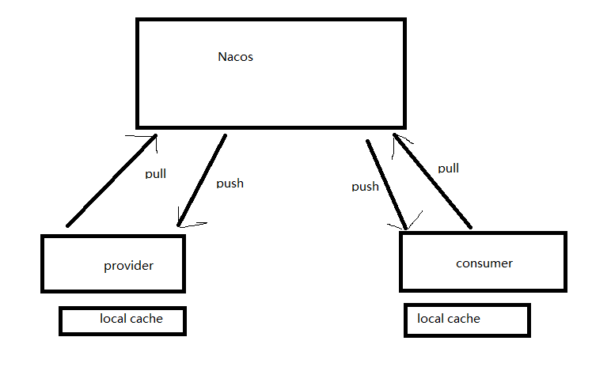
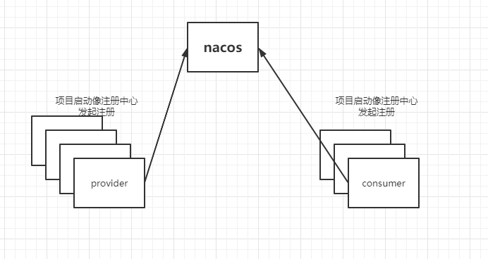
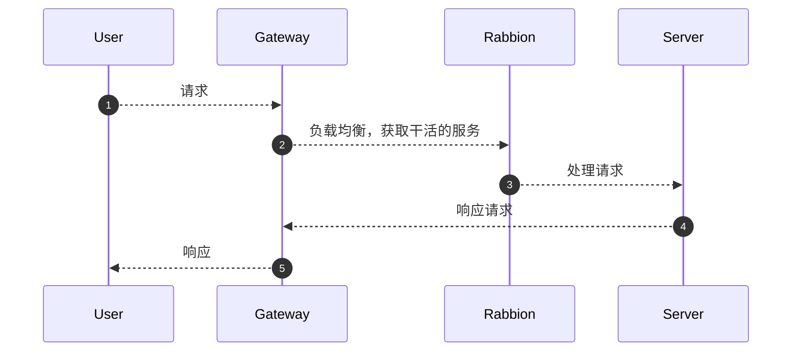
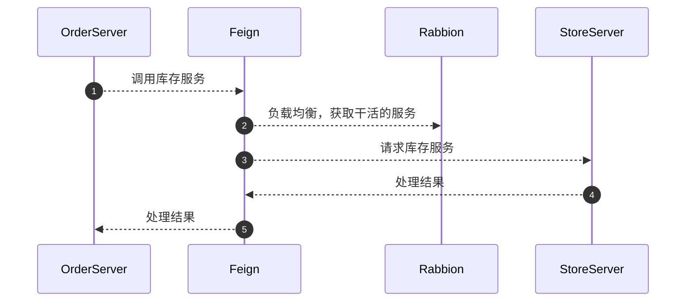

# 预备的几种方案

- Spring Cloud Alibaba
  - 组件丰富，NIO传输效率高
  - 迁移成本大，项目结构变化大
- Spring Cloud Netflix
  - 完整的解决方案相当于Spring Cloud Alibaba的弱化版
  - 迁移成本大，Netflix 实现组件很多都比不上Alibaba的。
- Spring Boot 散装需要的独立组件
  - 项目结构改动小，几乎无迁移成本
  - 按需去使用组件，因为不是一整套完整的解决方案。可能会出现一些奇怪的问题。

# Spring Boot 散装独立组件

## 使用组件

- Spring Boot(服务模块)
- Nacos(注册中心，配置中心)
- Rabbion(负载均衡)
- Gateway(网关)
- Open Feign(服务客户端)

## 配置中心

- 项目启动去nacos主动pull最新配置
- 配置发生改变nacos主动push变化到项目

## 注册中心

## 负载均衡

​		因为有**注册中心**所以有地方可以知道**A服务的所有实例**。给**负载均衡**提供了基础。

常见负载均衡策略

- 轮询
- 随机
- 一致性hash负载
- 最小活跃度
- 最短响应

## 集群容错

- Failover：失败自动重试。比如重试两次
  - 解决幂等的前提，dubbo的默认策略
- Failfast：快速失败
  - 直接报错，就是什么也不做。
- Failsafe：安全失败
  - 吞掉异常，可能只有日志这种会用到
- Failback：失败回滚
  - 需要MQ的支持，将失败的请求入队
- Forking：分发
  - 幂等为前提，将一个请求分发到所有server只要一个响应成功就立即返回。
- Broadcast：广播
  - 将一个请求分发到所有server只要一个响应失败就返回失败。

## 请求场景

### 外部请求

### 微服务内部调用

## 弊端

- 负载均衡策略少
- 服务容错要手写
- 没有多协议

# FAQ

spring gateway + nacos

- https://www.cnblogs.com/cailijuan/p/12024570.html

## 跨域

## 文件传输