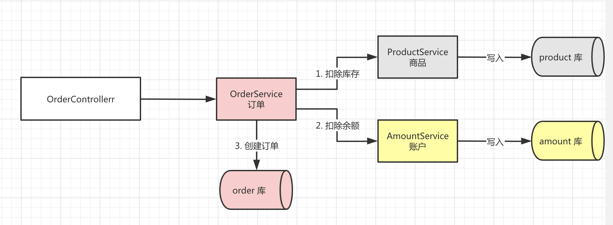
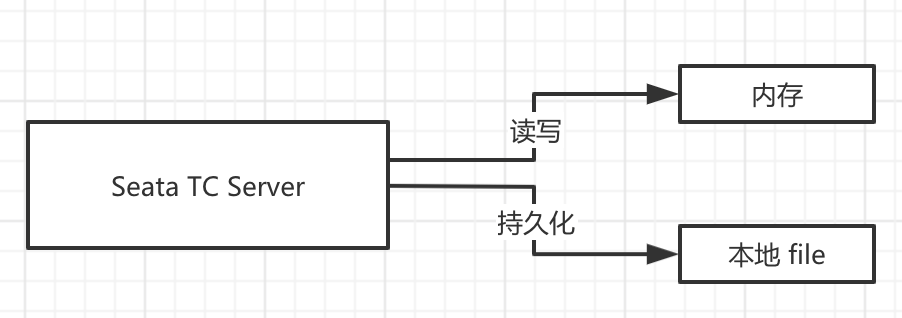
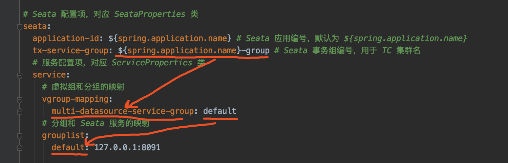

# Seata 学习笔记

参考连接

- http://www.iocoder.cn/categories/Seata/

- https://seata.io/zh-cn/docs/ops/deploy-by-docker.html


# 分布式事务简介

- XOpen/DTP 协议
- 分布式事务的三角色
  - Transaction Manager
  - Resource Manager
  - Application


# Seata 四种事务模式

- AT 模式
- TCC 模式
- Saga 模式
- XA模式(这个处于开发中)

> 目前流行程度：AT>TCC>Saga


# Seata三种角色

- Transaction Coordinator
  - 事务协调者：维护全局和分支事务的状态，驱动**全局事务**提交或回滚。
- Transaction Manager
  - 事务管理器：定义**全局事务**的范围，开始全局事务，提交或回滚全局事务。
- Resource Manager
  - 资源管理器：管理**分支事务**处理的资源(Resource)，与TC交谈以注册分支事务和报告分支事务的状态，并驱动**分支事务**提交或回滚。


其中，TC为单独部署的**Server**服务端，TM和RM嵌入到应用中的**Client**客户端。

在Seata中，一个分布式事务的**生命周期**如下



- TM请求TC开启一个全局事务。TC会生成一个**XID**作为该全局事务的编号。

  - > **XID**，会在微服务的调用链路中传播，保证将多个微服务的子事务关联在一起。

- RM请求TC将本地事务注册为全局事务的分支事务，通过全局事务的**XID**进行关联。

- TM请求TC告诉**XID**对应的全局事务是进行提交还是回滚。

- TC驱动RM们将**XID**对应的自己的本地事务进行提交还是回滚。

# Seata 部署

​		部署单机Seata **TC** Server，常用于学习或测试使用，不建议在生产环境中部署单机。

​		因为TC需要进行全局事务和分支事务的记录，所以需要对应的**存储**。目前，TC有两种存储模式（`store.mode`）。

- file模式：适合**单机**模式，全局事务会话信息在**内存**中读写，并持久化本地文件`root.ddata`，性能较高。
- db模式：适合**集群**模式，全局事务绘画信息通过**db**共享，相对性能较差。


​		显然，我们将采用file模式，最终我们部署但是TC Server如下图



## Docker 部署

- https://seata.io/zh-cn/docs/ops/deploy-by-docker.html

先通过最简的方式启动

```shell
docker run --name seata-server -p 8091:8091 seataio/seata-server:latest
```


## 下载Seata软件包

打开 [Seata 下载页面](https://github.com/seata/seata/releases)，选择想要的 Seata 版本。这里，我们选择 [v1.1.0](https://github.com/seata/seata/releases/tag/v1.1.0) 最新版本。

```shell
# 创建目录
$ mkdir -p /Users/yunai/Seata
$ cd /Users/yunai/Seata

# 下载
$ wget https://github.com/seata/seata/releases/download/v1.1.0/seata-server-1.1.0.tar.gz

# 解压
$ tar -zxvf seata-server-1.1.0.tar.gz

# 查看目录
$ cd seata
$ ls -ls
24 -rw-r--r--    1 yunai  staff  11365 May 13  2019 LICENSE
 0 drwxr-xr-x    4 yunai  staff    128 Apr  2 07:46 bin # 执行脚本
 0 drwxr-xr-x    9 yunai  staff    288 Feb 19 23:49 conf # 配置文件
 0 drwxr-xr-x  138 yunai  staff   4416 Apr  2 07:46 lib #  seata-*.jar + 依赖库
```

## 启动 TC Server

​		执行`nohup sh bin/seata-server/sh &`命令，启动TC Server在后台。在`nohup.out`文件中，我们看到如下日志，说明启动成功

```shell
# 使用 File 存储器
2020-04-02 08:36:01.302 INFO [main]io.seata.common.loader.EnhancedServiceLoader.loadFile:247 -load TransactionStoreManager[FILE] extension by class[io.seata.server.store.file.FileTransactionStoreManager]
2020-04-02 08:36:01.302 INFO [main]io.seata.common.loader.EnhancedServiceLoader.loadFile:247 -load SessionManager[FILE] extension by class[io.seata.server.session.file.FileBasedSessionManager]
# 启动成功
2020-04-02 08:36:01.597 INFO [main]io.seata.core.rpc.netty.RpcServerBootstrap.start:155 -Server started ...
```

- 默认配置下，Seata TC Server启动在8091端口。

因为我们使用file模式，所以可以看到用于持久化的本地文件`root.data`。操作命令如下

```shell
$ ls -ls sessionStore/
total 0
0 -rw-r--r--  1 yunai  staff  0 Apr  2 08:36 root.dat
```

# 部署集群TC Server

暂略


# AT模式

## AT模式+多数据源 Spring Boot集成

​		在Spring Boot**单体**项目中，如果使用了**多个**数据源，我们就需要考虑多个数据源的**一致性**，面临分布式事务的问题。


代码


### 准备Docker 容器

单独下软件有点麻烦，直接起容器对于测试学习来说成本最低

```msql
docker run --name my-mysql -e MYSQL_ROOT_PASSWORD=123456 -p 3306:3306 -d mysql
```


```shell
docker run --name seata-server -p 8091:8091 seataio/seata-server:latest
```


### 初始化数据库

使用`data.sql`脚本，创建`seata_order`，`seata_storage`，`seata_amount`

```sql
# Order
DROP DATABASE IF EXISTS seata_order;
CREATE DATABASE seata_order;

CREATE TABLE seata_order.orders
(
    id               INT(11) NOT NULL AUTO_INCREMENT,
    user_id          INT(11)        DEFAULT NULL,
    product_id       INT(11)        DEFAULT NULL,
    pay_amount       DECIMAL(10, 0) DEFAULT NULL,
    add_time         DATETIME       DEFAULT CURRENT_TIMESTAMP,
    last_update_time DATETIME       DEFAULT CURRENT_TIMESTAMP ON UPDATE CURRENT_TIMESTAMP,
    PRIMARY KEY (id)
) ENGINE = InnoDB AUTO_INCREMENT = 1 DEFAULT CHARSET = utf8;

CREATE TABLE seata_order.undo_log
(
    id            BIGINT(20)   NOT NULL AUTO_INCREMENT,
    branch_id     BIGINT(20)   NOT NULL,
    xid           VARCHAR(100) NOT NULL,
    context       VARCHAR(128) NOT NULL,
    rollback_info LONGBLOB     NOT NULL,
    log_status    INT(11)      NOT NULL,
    log_created   DATETIME     NOT NULL,
    log_modified  DATETIME     NOT NULL,
    PRIMARY KEY (id),
    UNIQUE KEY ux_undo_log (xid, branch_id)
) ENGINE = InnoDB AUTO_INCREMENT = 1 DEFAULT CHARSET = utf8;

# Storage
DROP DATABASE IF EXISTS seata_storage;
CREATE DATABASE seata_storage;

CREATE TABLE seata_storage.product
(
    id               INT(11) NOT NULL AUTO_INCREMENT,
    stock            INT(11)  DEFAULT NULL,
    last_update_time DATETIME DEFAULT CURRENT_TIMESTAMP ON UPDATE CURRENT_TIMESTAMP,
    PRIMARY KEY (id)
) ENGINE = InnoDB AUTO_INCREMENT = 1 DEFAULT CHARSET = utf8;
INSERT INTO seata_storage.product (id, stock) VALUES (1, 10); # 插入一条产品的库存

CREATE TABLE seata_storage.undo_log
(
    id            BIGINT(20)   NOT NULL AUTO_INCREMENT,
    branch_id     BIGINT(20)   NOT NULL,
    xid           VARCHAR(100) NOT NULL,
    context       VARCHAR(128) NOT NULL,
    rollback_info LONGBLOB     NOT NULL,
    log_status    INT(11)      NOT NULL,
    log_created   DATETIME     NOT NULL,
    log_modified  DATETIME     NOT NULL,
    PRIMARY KEY (id),
    UNIQUE KEY ux_undo_log (xid, branch_id)
) ENGINE = InnoDB AUTO_INCREMENT = 1 DEFAULT CHARSET = utf8;

# Amount
DROP DATABASE IF EXISTS seata_amount;
CREATE DATABASE seata_amount;

CREATE TABLE seata_amount.account
(
    id               INT(11) NOT NULL AUTO_INCREMENT,
    balance          DOUBLE   DEFAULT NULL,
    last_update_time DATETIME DEFAULT CURRENT_TIMESTAMP ON UPDATE CURRENT_TIMESTAMP,
    PRIMARY KEY (id)
) ENGINE = InnoDB AUTO_INCREMENT = 1  DEFAULT CHARSET = utf8;

CREATE TABLE seata_amount.undo_log
(
    id            BIGINT(20)   NOT NULL AUTO_INCREMENT,
    branch_id     BIGINT(20)   NOT NULL,
    xid           VARCHAR(100) NOT NULL,
    context       VARCHAR(128) NOT NULL,
    rollback_info LONGBLOB     NOT NULL,
    log_status    INT(11)      NOT NULL,
    log_created   DATETIME     NOT NULL,
    log_modified  DATETIME     NOT NULL,
    PRIMARY KEY (id),
    UNIQUE KEY ux_undo_log (xid, branch_id)
) ENGINE = InnoDB AUTO_INCREMENT = 1 DEFAULT CHARSET = utf8;
INSERT INTO seata_amount.account (id, balance) VALUES (1, 1);
```

​		其中，每个库中的`undo_log`表，是Seata AT模式必须创建的表，主要用于分支事务的回滚。

​		另外，考虑到测试方便，我们插入了一条`id=1`的`account`记录，和一条`id=1`的`product`记录。

### 引入依赖

创建`pom.xml`文件，引入相关的依赖。内容如下

```xml
<?xml version="1.0" encoding="UTF-8"?>
<project xmlns="http://maven.apache.org/POM/4.0.0"
         xmlns:xsi="http://www.w3.org/2001/XMLSchema-instance"
         xsi:schemaLocation="http://maven.apache.org/POM/4.0.0 http://maven.apache.org/xsd/maven-4.0.0.xsd">
    <parent>
        <groupId>org.springframework.boot</groupId>
        <artifactId>spring-boot-starter-parent</artifactId>
        <version>2.2.2.RELEASE</version>
        <relativePath/> <!-- lookup parent from repository -->
    </parent>
    <modelVersion>4.0.0</modelVersion>

    <artifactId>lab-52-multiple-datasource</artifactId>

    <dependencies>
        <!-- 实现对 Spring MVC 的自动化配置 -->
        <dependency>
            <groupId>org.springframework.boot</groupId>
            <artifactId>spring-boot-starter-web</artifactId>
        </dependency>

        <!-- 实现对数据库连接池的自动化配置 -->
        <dependency>
            <groupId>org.springframework.boot</groupId>
            <artifactId>spring-boot-starter-jdbc</artifactId>
        </dependency>
        <dependency> <!-- 本示例，我们使用 MySQL -->
            <groupId>mysql</groupId>
            <artifactId>mysql-connector-java</artifactId>
            <version>5.1.48</version>
        </dependency>

        <!-- 实现对 MyBatis 的自动化配置 -->
        <dependency>
            <groupId>org.mybatis.spring.boot</groupId>
            <artifactId>mybatis-spring-boot-starter</artifactId>
            <version>2.1.2</version>
        </dependency>

        <!-- 实现对 dynamic-datasource 的自动化配置 -->
        <dependency>
            <groupId>com.baomidou</groupId>
            <artifactId>dynamic-datasource-spring-boot-starter</artifactId>
            <version>3.0.0</version>
        </dependency>

        <!-- 实现对 Seata 的自动化配置 -->
        <dependency>
            <groupId>io.seata</groupId>
            <artifactId>seata-spring-boot-starter</artifactId>
            <version>1.1.0</version>
        </dependency>
    </dependencies>

</project>
```

- 引入`dynamic-datasource-spring-boot-starter`依赖，实现对`dynamic-datasource`的自动配置，用于多数据源的**切换**功能。
- 引入`seata-spring-boot-starter`依赖，实现对Seata的自动配置。


### 配置文件

​		创建`application.yml`配置文件，添加相关的配置项。内容如下。

```yaml
server:
  port: 8081 # 端口

spring:
  application:
    name: multi-datasource-service  # 应用名

  datasource:
    # dynamic-datasource-spring-boot-starter 动态数据源的配配项，对应 DynamicDataSourceProperties 类
    dynamic:
      primary: order-ds # 设置默认的数据源或者数据源组，默认值即为 master
      datasource:
        # 订单 order 数据源配置
        order-ds:
          url: jdbc:mysql://127.0.0.1:3306/seata_order?useSSL=false&useUnicode=true&characterEncoding=UTF-8
          driver-class-name: com.mysql.jdbc.Driver
          username: root
          password:
        # 账户 pay 数据源配置
        amount-ds:
          url: jdbc:mysql://127.0.0.1:3306/seata_pay?useSSL=false&useUnicode=true&characterEncoding=UTF-8
          driver-class-name: com.mysql.jdbc.Driver
          username: root
          password:
        # 库存 storage 数据源配置
        storage-ds:
          url: jdbc:mysql://127.0.0.1:3306/seata_storage?useSSL=false&useUnicode=true&characterEncoding=UTF-8
          driver-class-name: com.mysql.jdbc.Driver
          username: root
          password:
      seata: true # 是否启动对 Seata 的集成

# Seata 配置项，对应 SeataProperties 类
seata:
  application-id: ${spring.application.name} # Seata 应用编号，默认为 ${spring.application.name}
  tx-service-group: ${spring.application.name}-group # Seata 事务组编号，用于 TC 集群名
  # 服务配置项，对应 ServiceProperties 类
  service:
    # 虚拟组和分组的映射
    vgroup-mapping:
      multi-datasource-service-group: default
    # 分组和 Seata 服务的映射
    grouplist:
      default: 127.0.0.1:8091
```

- `spring.datasource.dynamic`配置项，设置`dynamic-datasource-spring-boot-starter`动态数据源的配置项，对应[DynamicDataSourceProperties](https://github.com/baomidou/dynamic-datasource-spring-boot-starter/blob/master/src/main/java/com/baomidou/dynamic/datasource/spring/boot/autoconfigure/DynamicDataSourceProperties.java) 类。

**注意**，一定要设置`spring.datasource.dynamic,seata`配置项为`true`，开启对Seata的集成。

- `seata`配置项，对应 [SeataProperties](https://github.com/seata/seata/blob/develop/seata-spring-boot-starter/src/main/java/io/seata/spring/boot/autoconfigure/properties/SeataProperties.java) 类。
  - `application-id`配置项对应Seata应用编号，默认为`${spring.application.name}`。实际上，可以不进行设置。
  - `tx-service-group`配置项，Seata事务组编号，用于TC 集群名。
- `seata.service`配置项，Seata 服务配置项，对应 [ServiceProperties](https://github.com/seata/seata/blob/develop/seata-spring-boot-starter/src/main/java/io/seata/spring/boot/autoconfigure/properties/file/ServiceProperties.java) 类。它主要用于 Seata 在事务分组的特殊设计，可见[《Seata 文档 —— 事务分组专题》](https://seata.io/zh-cn/docs/user/transaction-group.html)。如果不能理解的胖友，可以见如下图：



简单来说，就是多了一层`虚拟`映射。这里，我们**直接**设置TC Server的地址，为`127.0.0.1:8091`

### 订单模块


Controller

```java
@Slf4j
@RestController
@RequestMapping("/order")
public class OrderController {
    @Resource
    private OrderService orderService;
    
    @PostMapping("/create")
    public Integer createOrder(@RequestParam Long userId,
                              @RequestParam Long productId,
                              @RequestParam Integer price) throws Exception {
        log.info("[createOrder] 收到下单请求，用户{},商品{},价格{}", userId, productId, price);
        return orderService.createOrder(userId, productId, price);
    }
}
```


Service

```java
@Slf4j
@Service
public class OrderServiceImpl implements OrderService {
    @Resource
    private OrderDao orderDao;
    @Resource
    private AccountService accountService;
    @Resource
    private ProductService productService;
    
    @Override
    @DS(value = "orderDS")	// 1
    @GlobalTransactional	// 2
    public Integer createOrder(Long userId, Long productId, Integer price) throws Exception {
        Integer amount = 1;// 购买数量，暂定为1
        log.info("[createOrder]当前XID{}"， RootContext.getXID());
        
        // 3 扣减库存
        productService.reduceStock(productId, amount);
        
        // 4 扣减余额
        accountService.reduceBalance(userId, price);
        
        // 5 保存订单
        OrderDO order = new OrderDO().
            setUserId(userId).setProductId(productId)
            .setPayAmout(amout*price);
        orderDao.saveOrder(order);
        log.infn("[createOrder]保存订单:{}", order.getId());
        
        // 返回订单编号
        return order.getId();
    }
}
```


1. `@DS`主键，设置使用`order-ds`订单数据源。
2. 添加Seata`@GlobalTransactional`注解，**声明全局事务**。
3. 调用`ProductService`扣除商品的库存。虽然说在同一个**JVM进程**，但是操作的不是一个数据库。
4. 调用`AccountService`扣减余额。虽然说在同一个**JVM进程**，但是操作的不是一个数据库。
5. 在全部调用成功后，调用`OrderDao`保存订单。


OrderDao

```java
@Mapper
@Repository
public interface OrderDao {
    @Insert("INSERT INTO orders (user_id, product_id, pay_amount) VALUES (#{userId}, #{productId}, #{payAmount})")
    @Options(useGeneratedKeys = true, keyColumn = "id", keyProperty = "id")
    int saveOrder(OrderDO order);
}
```


OrderDO 对应`orders`表

```java
@Data
public class OrderDO {
    private Integer id;
    private Long userId;
    private Long productId;
    private Integer payAmount;
}
```


### 商品模块

ProductServiceImpl

```java
@Slf4j
@Service
public class ProductServiceImpl implements ProductService {
    @Resouce
    private ProductDao productDao;
    
    @Override
    @DS(value = "product-ds")//1
    @Transactionl(propagation=Propagation.REQUEIRES_NEW)//2开启新事务
    public void reduceStock(Long productId, Integer amount) throws Exception {
        log.info("[reduceStock] 当前 XID: {}", RootContext.getXID());
        
        // 3 检查库存
        checkStock(productId, amount);
        
        log.info("[reduceStock] 开始扣减{}库存", productId);
        // 4 扣减库存
        int updateCount = productDao.reduceStock(productId, amount);
        // 扣除失败
        if (updateCount == 0) {
            log.warn("[reduceStock]扣除{}库存失败", productId);
            throw new Exception("库存不足");
        }
        // 扣除成功
        log.info("[reduceStock]扣除{}库存成功", productId);    
    }
    
    private void checkStock(Long productId, Integer requiredAmount) throws Exception {
        log.info("[checkStock]检查{}库存", productId);
        Integer stock = productDao.getStock(productId);
        if (stock < requiredAmount) {
            log.warn("[checkStock] {} 库存不足，当前库存：{}", productId, stock);
            throw new Exception("库存不足");
        }
    }
    
}
```


1. `DS`注解，设置使用`product-ds`商品数据源
2. `@Transactional`注解，**声明本地事务**。也就是说，此处会开启一个`seata_product`库的数据库事务。
3. 检查库存是否足够，如果不够则抛出Exception。因为需要异常，回滚全局事务。
4. 进行扣除库存，如果扣除失败则抛出Exception。


ProductDao

```java
@Mapper
@Repository
public interface ProductDao {
    @Select("SELECT stock FROM product WHERE ID = #{productId}")
    Integer getStock(@Param("productId") Long productId);
    
    @Update("UPDATE product SET stock = stock - #{amount} WHERE id=#{productId} AND stock >= #{amount}")
    int reduceStock(@Param("productId") Long productId, @Param("amount") Integer amount);
}
```


### 账户模块

逻辑和`商品模块`基本一致，也是扣减逻辑。


AccountServiceImpl

```java
@Slf4j
@Service
public class AccountServiceImpl implements AccountService {
    @Resource
    private AccountDao accountDao;
    
    @Override
    @DS(value = "account-ds")//1
    @Transactional(propagation=Propagation.REQUIRES_NEW)//2开启新事务
    public void reduceBalance(Long userId, Integer price) throws Exception {
        log.info("[reduceBalance] 当前 XID: {}", RootContext.getXID());
        
        // 3 检查余额
        checkBalance(userId, price);
        
        log.info("[reduceBalance]开始扣减用户{}余额", userId);
        // 4 扣减余额
        int updateCount = accountDao.reduceBalance(price);
        // 扣除失败
        if (updateCount==0) {
            log.warn("[reduceBalance]扣除用户{}余额失败", userId);
            throw new Exception("余额不足");
        }
        // 扣除成功
        log.info("[reduceBalance]扣除用户{}余额成功", userId);
    }
    
    private void checkBalance(Long userId, Integer price) throws Exception {
        log.info("[checkBalance]检查用户{}余额", userId);
        Integer balance = accountDao.getBalance(userId);
        if (balance < price) {
            log.warn("[checkBalance]用户:{}余额不足，当前余额:{}", userId, balance);
            throw new Exception("余额不足");
        }
    }
}
```

1. `@DS`注解，设置使用`account-ds`账户数据源。
2. `@Transactional`注解，**声明本地事务**。也就是说，此处会开启一个`seata_account`库的数据库事务。
3. 检查余额是否足够，如果不够则抛出 Exception 异常。因为我们需要通过异常，回滚全局异常。
4. 进行扣除余额，如果扣除失败则抛出 Exception 异常。


AccountDao

```java
@Mapper
@Repository
public interface AccountDao {
    @Select("SELECT balance FROM account WHERE id=#{userId}")
    Integer getBalance(@Param("userId") Long userId);
    
    @Update("UPDATE account SET balance = balance - #{price} WHERE id=1 AND balance >= ${price}")
    int reduceBalance(@Param("price") Integer price);
}
```

### `MultipleDatasourceApplication`

```java
@SpringApplication
public class MultipleDatasourceApplication {
    public static void main(String[] args) {
        SpringApplication.run(MultipleDatasourceApplication.class, args);
    }
}
```


# FAQ

Seata Server

- docker 启动及修改配置：https://www.jianshu.com/p/2e4ed0df8b37
- docker 容器安装软件：https://www.cnblogs.com/wangjinyu/p/13025754.html
- docker 容器网络互联：https://www.cnblogs.com/shenh/p/9714547.html

**no available service 'null' found, please make sure registry config correct**

- https://blog.csdn.net/lyd135364/article/details/104862134

## Docker 安装 Seata

- 使用 `--link nacos:nacos` 使seata容器和nacos容器能够互联

```shell
docker run --name seata-server -p 8091:8091 --link nacos:nacos seataio/seata-server:latest
```

- 进入容器

```shell
docker ps
docker exec -it 3bbcb8b13b15 /bin/bash
# 进入容器后
apt-get update
apt-get install vim
# registry 和 config 的 type 属性都修改为 nacos
# nacos的serverAddr="nacos:8848"
vim resources/registry.conf
```

## Seata Server IP问题

2020年11月17日，因为使用Docker 安装的 Nacos和Seata Server，然后外部又创建的Java项目在连接，出现了很多内部IP的情况导致Java项目无法启动。

> 需要梳理好Docker 容器对外暴露的IP。短时间不好解决Seata先放放。