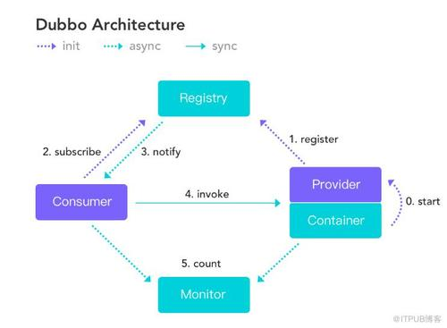

# Dubbo



学习版本：2.7.8

日期：2020年11月14日

作者：马林


# 初识Dubbo

## 为什么要使用Dubbo

- 服务治理框架
- 服务的监控
- 服务的注册发现
- 服务的通讯
- 服务的容错
- 服务的负载均衡

spring cloud团队Spring Cloud Alibaba

- Dubbo
- seata
- RocketMQ
- Nacos
- Sentinel

## Dubbo怎么去用

`dubbo-learn-demo` 项目

`dubbo://192.168.56.1:20880/com.dubbo.learn.ISayHelloService`

`http://ip:port/mapping`


## Dubbo支持的注册中心

- consul
- zookeeper
- eureka
- redis
- etcd
- nacos
- ......

# Dubbo Spring Cloud

`spring-cloud-dubbo-example` 项目

## 创建项目

- 创建一个`spring-cloud-dubbo-example`的maven工程
- 分别添加三个模块
  - `spring-cloud-dubbo-api`
  - `spring-cloud-dubbo-provider`
  - `spring-cloud-dubbo-consumer`

## 定义服务接口

在`spring-boot-dubbo-api`模块中定义接口

```java
public interface IHelloService {
    String sayHello();
}
```


## 实现服务

在`spring-boot-dubbo-provider`中，实现`IHelloService`接口

```java
public class HelloServiceImpl implements IHelloService {
    @Override
    public String sayHello() {
        return "Hello";
    }
}
```

添加`@EnableDiscoveryClient`注解

```java
@EnableDiscoveryClient
@SpringBootApplication
public class Application {
    public static void main(String[] args) {
        SpringApplication.run(Application.class, args);
    }
}
```

## 配置Dubbo服务发布

在服务实现类中添加`@Service`，**注意这不是spring的@service而是dubbo的@Service。**

```java
@Service
public class HelloServiceImpl implements IHelloService {
    @Override
    public String sayHello() {
        return "Hello";
    }
}
```

配置Dubbo的provider信息

```properties
# dubbo 服务扫描基础包
dubbo.scan.base-package=com.springcloud.dubbo
dubbo.protocol.id=dubbo
# dubbo服务暴露的协议配置，name为协议名称，port为协议端口(-1表示子增端口，从20880开始)
dubbo.protocol.name=dubbo
dubbo.protocol.port=-1

spring.cloud.nacos.discovery.server-addr=127.0.0.1:8848
```

- `dubbo.scan.base-package`：指定dubbo服务实现类的扫描基础包
- `dubbo.protocol`：dubbo服务暴露协议配置，其中子数学`name`为协议名称，`port`为协议端口(-1表示自增端口，从20880开始)
- `dubbo.registry`：dubbo服务注册中心配置，其中子属下`address`的值`spring-cloud://localhost`，说明挂载到Spring Cloud注册中心
- `spring.cloud.nacos.discovery`：nacos服务发现与注册配置，其中子属性`server-addr`指定nacos服务器主机和端口

## 版本规范

​		项目的版本号格式为`x.x.x`的形式，从0开始取值，且不限于0-9这个范围。项目处于孵化器阶段时，第一位版本号固定使用0，即版本为`0.x.x`的格式。

​		由于Spring Boot 1和Spring Boot 2在`Actuator`模块的接口和注解有很大的变更，且`spring-cloud-commons`从`1.x.x`版本升级到`2.0.0`版本也有较大的变更，因此我们采取跟Spring Boot版本号一致的版本

- 1.5.x版本适用于Spring Boot 1.5.x
- 2.0.x版本适用于Spring Boot 2.0.x
- 2.1.x版本适用于Spring Boot 2.1.x
- 2.2.x版本适用于Spring Boot 2.2.x

## 构建服务消费者

添加jar包依赖

```xml
<dependency>
    <groupId>com.alibaba.cloud</groupId>
    <artifactId>spring-cloud-starter-dubbo</artifactId>
</dependency>
<dependency>
    <groupId>org.springframework.boot</groupId>
    <artifactId>spring-boot-actuator</artifactId>
</dependency>
<dependency>
    <groupId>com.gupaoedu.dubbo</groupId>
    <version>1.0-SNAPSHOT</version>
    <artifactId>spring-cloud-dubbo-sample-api</artifactId>
</dependency>
<dependency>
    <groupId>com.alibaba.cloud</groupId>
    <artifactId>spring-cloud-starter-alibaba-nacos-discovery</artifactId>
</dependency>
<dependency>
    <groupId>org.springframework.boot</groupId>
    <artifactId>spring-boot-starter-web</artifactId>
</dependency>
```

添加配置文件

```properties
spring.application.name=spring-cloud-dubbo-consumer
dubbo.application.name=spring-cloud-dubbo-consumer

dubbo.cloud.subscribed-services=spring-cloud-dubbo-sample-provider
spring.cloud.nacos.discovery.server-addr=127.0.0.1:8848
```

除应用名称`spring.application.name`存在差异外，`spring-cloud-doubo-client`新增了属性`dubbo.cloud.subscribed-services`的设置。并且该值为服务提供放应用`spring-cloud-dubbo-provider`。

它的主要作用时服务消费方订阅服务提供方的应用名称列表，若需订阅多应用，使用`,`分割。不推荐使用默认值`*`，它将订阅所有应用。

-----

编写测试代码

```java
@RestController
@EnableDiscoveryClient
@SpringBootApplication
public class Application {
    public static void main(String[] args) {
        SpringApplication.run(Application.class, args);
    }
    
    @Reference
    IHelloService helloService;
    
    @GetMapping("/say")
    public String say() {
        return helloService.sayHello();
    }
}
```


# Dubbo Spring Boot

`springboot-dubbo-example` 

## 基于Spring Boot集成Dubbo方式

dubbot集成到spring boot中有一个好处，就是它可以继承spring boot本身的特性。

- 自动装填（注解驱动，自动装配）
- production-ready（安全机制，健康检查，外部化配置）

### 创建项目

项目结构

- `spring-boot-dubbo-example[maven]`
  - `spring-boot-dubbo-api[maven]`
  - `spring-boot-dubbo-provider[spring boot]`
  - `spring-boot-dubbo-consumer[spring boot]`

### 添加jar包依赖

​		从2.7开始，dubbo的版本和dubbo-spring-boot的版本是保持一致的。

```xml
<dependency>
	<groupId>org.apache.dubbo</groupId>
    <artifactId>dubbo-spring-boot-starter</artifactId>
    <version>2.7.7</version>
</dependency>
<dependency>
	<groupId>com.alibaba.nacos</groupId>
    <artifactId>nacos-client</artifactId>
    <version>1.2.1</version>
</dependency>
```

## 添加服务以及发布

```java
@DubbotService
public class SayHelloServiceImpl implements ISayHelloService {
    @Override
    public String sayHello() {
        return "Hello World";
    }
}
```


```properties
spring.application.name=spring-boot-dubbo-provider

dubbo.registry.address=nacos://127.0.0.1:8848
dubbo.scan.base-package=com.springboot.dubbo.example.provider.service

dubbo.protocol.name=dubbo
dubbo.protocol.port=-1
```


## 编写服务引用代码

添加jar包依赖

```xml
<dependency>
	<groupId>org.springframework.boot</groupId>
    <artifactId>spring-boot-starter-web</artifactId>
</dependency>
<dependency>
	<groupId>com.springboot.dubbo.example.api</groupId>
    <artifactId>spring-boot-dubbo-api</artifactId>
    <version1.0-SNAPSHOT></version>
</dependency>
<dependency>
	<groupId>org.apache.dubbo</groupId>
    <artifactId>dubbo-spring-boot-starter</artifactId>
    <version>2.7.7</version>
</dependency>
<dependency>
	<groupId>com.alibaba.nacos</groupId>
    <artifactId>nacos-client</artifactId>
    <version>1.2.1</version>
</dependency>
```


添加web测试类

```java
@DubboReference
private ISayHelloService sayHelloService;

@GetMapping("/get")
public String get() {
    return sayHelloService.sayHello();
}
```


```properties
dubbo.registry.address=nacos://127.0.0.1:8848
```


## 多注册中心

```properties
dubbo.registries.shanghai.address=zookeeper://127.0.0.1:2181
dubbo.registries.shanghai.timeout=10000
dubbo.registries.shanghai.default=true

dubbo.registries.hubei.address=nacos://127.0.0.1:8848
dubbo.registries.hubei.timeout=10000
```

## 版本

provider

```java
@DubboService(registry = {"shanghai", "hubei"}, version = "1.0")
public class SayHelloServiceImpl implements ISayHelloService {
    @Override
    public String sayHell() {
        System.out.println("11");
        return "[Version1.0]Hello World";
    }
}
@DubboService(registry = {"shanghai", "hubei"}, version = "2.0")
public class SayHelloServiceImpl2 implements ISayHelloService {
    @Override
    public String sayHell() {
        System.out.println("11");
        return "[Version2.0]Hello World";
    }
}
```


consumer

```java
@DubboReference(registry = {"shanghai", "hubei"}, version = "1.0")
private ISayHelloService sayHelloService;
```


# FAQ

ZK安装: https://blog.csdn.net/qq_26641781/article/details/80886831

nacos安装： https://www.jianshu.com/p/e053f016371a

ZooInspector：https://www.cnblogs.com/lwcode6/p/11586537.html     https://issues.apache.org/jira/secure/attachment/12436620/ZooInspector.zip