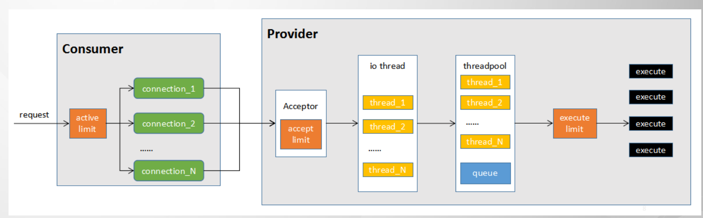
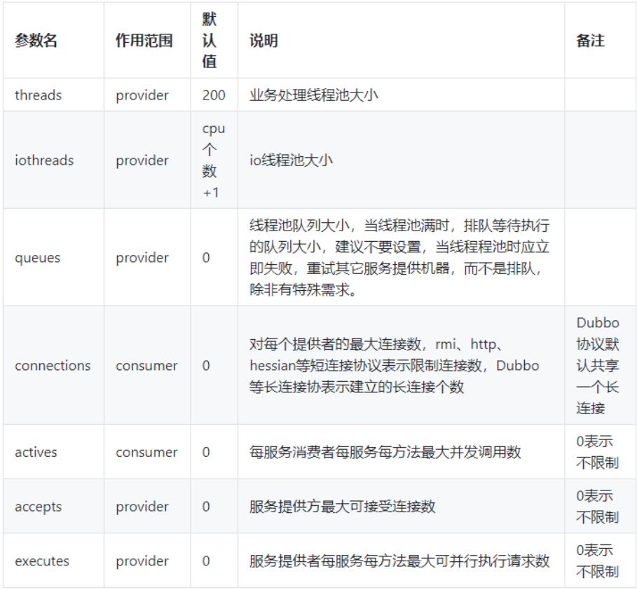
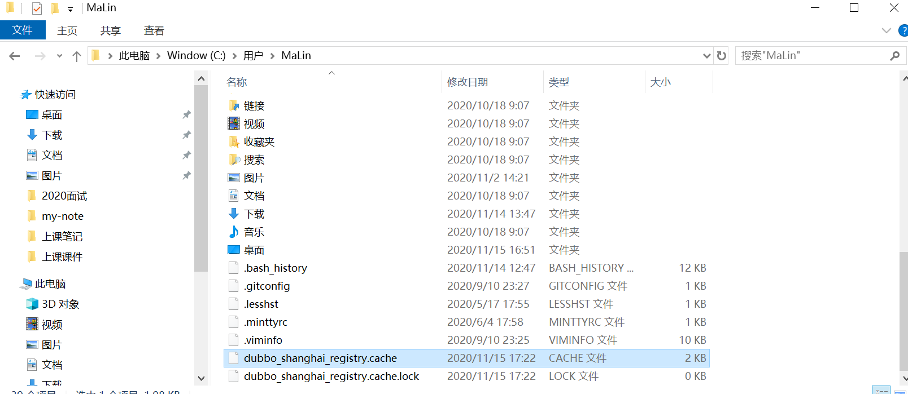
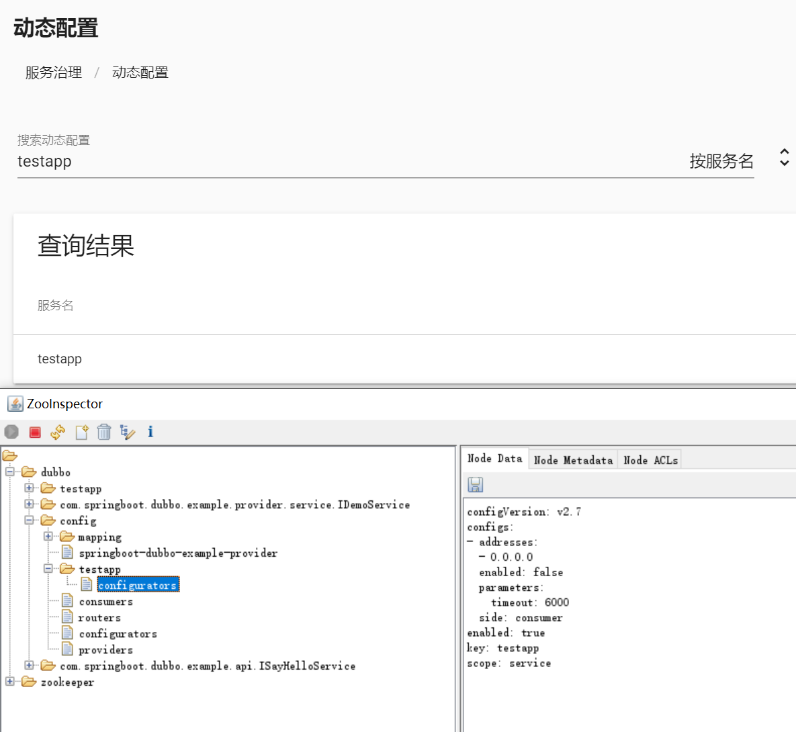

# Dubbo的常见功能

## 多序列化支持

(gRPC)protobuf / json / xml ...
dubbo hessian(2)
webservice / xml
fst / kryo / protostuff / gson /avro 。。。  

优势

添加jar包支持

```xml
<dependency>
	<groupId>com.esotericsoftware</groupId>
    <artifactId>kryo</artifactId>
    <version>4.0.2</version>
</dependency>
<dependency>
	<groupId>de.javakaffee</groupId>
    <artifactId>kryo-serializers</artifactId>
    <version>0.45</version>
</dependency>
```

添加序列化支持

```properties
dubbo.protocol.serialization=kryo
```

## 性能调优的参数

http://dubbo.apache.org/zh-cn/docs/2.7/user/references/xml/dubbo-service/

http://dubbo.apache.org/zh-cn/docs/2.7/user/references/xml/dubbo-reference/





## Dubbo缓存文件

配置服务地址的缓存，避免注册中心挂了之后对于服务通信的影响。

这个配置应该配置在consumer端

```properties
dubbo.registries.shanghai.address=zookeeper://127.0.0.1:2181
dubbo.registries.shanghai.timeout=10000
dubbo.registries.shanghai.default=true
# 服务启动的时候，如果注册中心不可用，那么服务启动失败
dubbo.registries.shanghai.check=true
dubbo.registries.shanghai.weight=100
dubbo.registries.shanghai.file=${user.home}/dubbo_shanghai_registry.cache

dubbo.registries.hubei.address=nacos://127.0.0.1:8848
dubbo.registries.hubei.timeout=10000
dubbo.registries.hubei.weight=10
dubbo.registries.hubei.file=${user.home}/dubbo_hubei_registry.cache
```



## Dubbo配置中心

因为命令行操作zookeeper太麻烦。通过dubbo-admin来辅助。

```shell
docker-compose -f stack.yml up -d
```

```yaml
version: '3'

services:
  zookeeper:
    image: zookeeper
    ports:
      - 2181:2181
  admin:
    image: apache/dubbo-admin
    depends_on:
      - zookeeper
    ports:
      - 8888:8080
    environment:
      - admin.registry.address=zookeeper://zookeeper:2181
      - admin.config-center=zookeeper://zookeeper:2181
      - admin.metadata-report.address=zookeeper://zookeeper:2181
```





provider consumer等应用如何使用这些配置？

```properties
spring.application.name=springboot-dubbo-example-provider

dubbo.config-center.address=zookeeper://127.0.0.1:2181
dubbo.config-center.timeout=10000
```


> 但是但是。。。不知道是不是不稳定的缘故。 2.7.7 这个版本动态配置中心还是用不了。 非常非常的蛋疼

## Dubbo qos(Quality of Service)运维平台

https://blog.csdn.net/yuanshangshenghuo/article/details/107563319

```properties
dubbo.application.qos-port=7777
dubbo.application.qos-accept-foreign-ip=false
dubbo.application.qos-enable=true
```


# FAQ

dubbo-admin

- https://github.com/apache/dubbo-admin
- https://hub.docker.com/r/apache/dubbo-admin
- https://blog.csdn.net/zsx18273117003/article/details/100699894