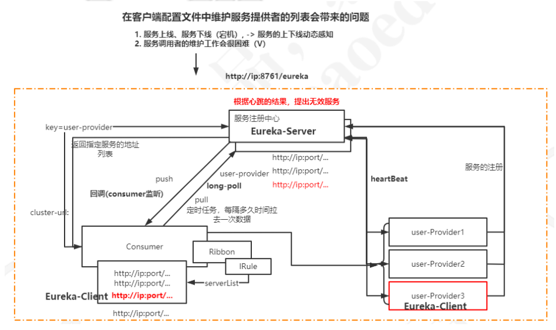
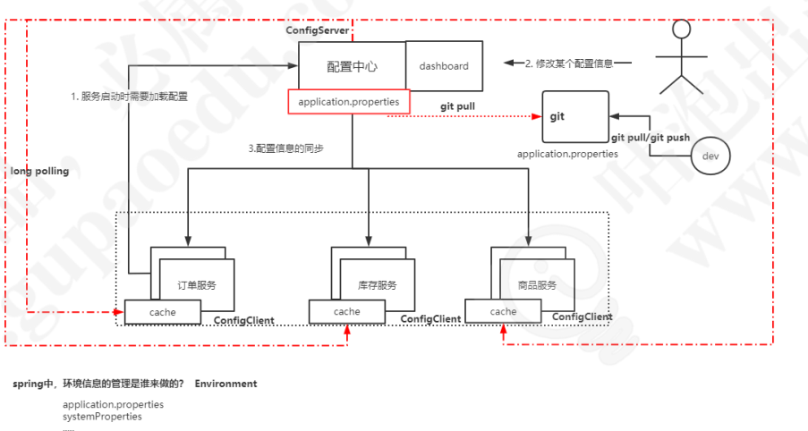
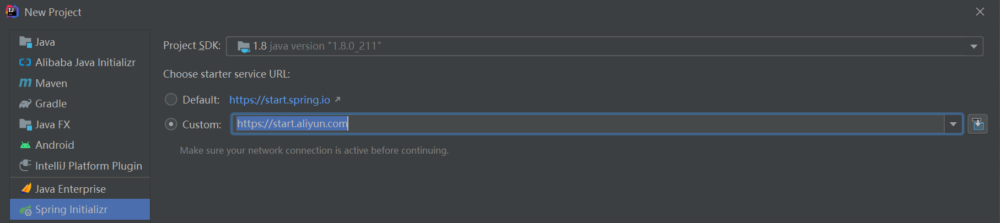

# Nacos是什么

​		Nacos提供了统一配置管理、服务发现与注册。其中服务注册和发现的功能，相当于dubbo里面使用到的zookeeper或者spring cloud里面应用到的consoul以及eureka。


# Nacos的特性

## 服务发现和服务健康监测

​		Nacos提供了基于RPC的服务发现，服务提供者可以将自身的服务通过原生API或者openAPI来实现服务的注册，服务消费者可以使用API或者Http来查找和发现服务。

​		同时，Nacos提供了对服务的实时监控检查，当发现服务不可用时，可以实现对服务的动态下线从而阻止服务消费者向不健康的服务发送请求。

## 配置管理

​		传统的配置管理，是基于项目中的配置文件来实现，当出现配置文件变更时需要重新部署，而动态配置中心可以将配置进行统一的管理，使得配置变得更加灵活以及高效。

​		动态配置中心可以实现路由规则的动态配置、限流规则的动态配置、动态数据源、开关、动态UI等场景。

​		国内比较有名的开源配置中心：Apollo、diamond、disconf。

# 简述服务配置中心和注册中心


## 服务注册中心




## 服务配置中心



# Nacos的基本应用


## Nacos下载

​		首先，我们需要先启动Nacos服务，启动服务有两种方式，一种是直接下载已经编译好的包直接运行。另一种是通过源码来构建。我们基于源码先来构建。

​		因为目前版本发布比较频繁，内容一直在变化。简单了解它的应用就可以。


## 从github上下载源码

```shell
git clone https://github.com/alibaba/nacos.git
cd nacos/
mvn -Prelease-nacos clean install -U
ls -al distribution/target/
cd distribution/target/nacos-server-$version/nacos/bin
```


## 启动服务

```shell
linux系统下： sh startup.sh -m standalone
window系统： cmd startup.cmd
```


## docker安装nacos

```shell
docker run -d --name nacos-server-8848 -p 8848:8848 --privileged=true -v /opt/nacos/init.d/custom.properties:/home/nacos/init.d/custom.properties -v /opt/nacos/logs:/home/nacos/logs --restart=always -e MODE=standalone -e PREFER_HOST_MODE=hostname nacos/nacos-server
```


## 访问nacos

http://localhost:8848/nacos

默认账号密码：nacos/nacos


# Nacos注册中心实战

> 基于spring cloud alibaba。 **非常可惜 可能因为版本的问题如何也注册不到Nacos**
>
> 只好参考教程的 `20200826` 的版本实现


## 创建一个项目

- 创建一个`spring-cloud-dubbo-example`的maven工厂
- 分别添加三个模块
  - `spring-cloud-dubbo-sample-api`
  - `spring-cloud-dubbo-sample-provider`
  - `spring-cloud-dubbo-sample-consumer`

> 其中后面两个模块都是Spring Boot的应用。

修改`spring-cloud-dubbo-sample-provider`这个模块中。

- 将`dependencyManagement`部分的依赖移动到`parent的 pom.xml`

> spring boot采用2.2.x/spring cloud alibaba采用2.2.1

```xml
<dependencyManagement>
    <dependencies>
        <dependency>
            <groupId>com.alibaba.cloud</groupId>
            <artifactId>spring-cloud-alibaba-dependencies</artifactId>
            <version>${spring-cloud-alibaba.version}</version>
            <type>pom</type>
            <scope>import</scope>
        </dependency>
        <dependency>
            <groupId>org.springframework.boot</groupId>
            <artifactId>spring-boot-dependencies</artifactId>
            <version>${spring-boot.version}</version>
            <type>pom</type>
            <scope>import</scope>
        </dependency>
    </dependencies>
</dependencyManagement>
```

- 修改`spring-cloud-dubbo-sample-provider`中的`pom.xml`，增加parent模块的依赖

```xml
<parent>
    <artifactId>spring-cloud-nacos-dubbo-provider</artifactId>
    <groupId>com.gupaoedu.example</groupId>
    <version>1.0-SNAPSHOT</version>
</parent>
```

- 增加maven依赖

```xml
<dependency>
    <artifactId>nacos-dubbo-provider-api</artifactId>
    <groupId>com.gupaoedu.example</groupId>
    <version>1.0-SNAPSHOT</version>
</dependency>
<dependency>
    <groupId>com.alibaba.cloud</groupId>
    <artifactId>spring-cloud-starter-alibaba-nacos-discovery</artifactId>
</dependency>
<dependency>
    <groupId>com.alibaba.cloud</groupId>
    <artifactId>spring-cloud-starter-dubbo</artifactId>
</dependency>
```


## 定义服务接口

在`spring-boot-sample-api`模块中，定义接口

```java
public interface IHelloService {
    String sayHello();
}
```


## 实现服务

在`spring-boot-dubbo-sample-provider`中，实现`IHelloService`接口

```java
public class HelloServiceImpl implements IHelloService {
    @Override
    public String sayHello() {
        return "Hello World";
    }
}
```

添加`@EnableDiscoveryClient`注解

```java
@EnableDiscoveryClient
@SpringBootApplication
public class SpringCloudDubboSampleProviderApplication {
    public static void main(String[] args) {
        SpringApplication.run(SpringCloudDubboSampleProviderApplication.class, args);
    }
}
```


## 配置dubbo服务发布

- 在服务实现类中添加`@Service`注解

```java
@Service
public class HelloServiceImpl implements IHelloService {
    @Override
    public String sayHello() {
        return "Hello World";
    }
}
```

- 配置dubbo提供方信息

```properties
# dubbo 服务扫描基础包路径
dubbo.scan.base-packages=com.gupaoedu.dubbo.springclouddubbosampleprovider

dubbo.protocol.id=dubbo
# Dubbo 服务暴露的协议配置，其中子属性 name 为协议名称，port 为协议端口（ -1 表示自增端口，从 20880 开始）
dubbo.protocol.name=dubbo
dubbo.protocol.port=-1

spring.cloud.nacos.discovery.server-addr=192.168.216.128:8848
```

- `dubbo.scan.base-packages`：指定dubbo服务实现类的扫描基础包
- `dubbo.protocol`：dubbo服务暴露的协议配置，其中子属性`name`为协议名称，`port`为协议端口（-1表示自增端口，从20880开始）
- `dubbo.registry`：Dubbo服务注册中心配置，其中子属性`address`的值`spring-cloud://localhost`，说明挂载到Spring Cloud注册中心。
- `spring.cloud.nacos.discovery`：Nacos服务发现与注册配置，其中子属性`server-addr`指定Nacos服务器主机和端口。

## 版本规范

​		项目的版本号格式为`x.x.x`的形式，从0开始取值，且不限于0-9这个范围。项目处于孵化器阶段时，第一位版本号固定使用0，即版本为`0.x.x`的格式。

​		由于Spring Boot 1和Spring Boot 2在`Actuator`模块的接口和注解有很大的变更，且`spring-cloud-commons`从`1.x.x`版本升级到`2.0.0`版本也有较大的变更，因此我们采取跟Spring Boot版本号一致的版本

- 1.5.x版本适用于Spring Boot 1.5.x
- 2.0.x版本适用于Spring Boot 2.0.x
- 2.1.x版本适用于Spring Boot 2.1.x
- 2.2.x版本适用于Spring Boot 2.2.x

## 构建服务消费者

添加jar包依赖

```xml
<dependency>
    <groupId>com.alibaba.cloud</groupId>
    <artifactId>spring-cloud-starter-dubbo</artifactId>
</dependency>
<dependency>
    <groupId>org.springframework.boot</groupId>
    <artifactId>spring-boot-actuator</artifactId>
</dependency>
<dependency>
    <groupId>com.gupaoedu.dubbo</groupId>
    <version>1.0-SNAPSHOT</version>
    <artifactId>spring-cloud-dubbo-sample-api</artifactId>
</dependency>
<dependency>
    <groupId>com.alibaba.cloud</groupId>
    <artifactId>spring-cloud-starter-alibaba-nacos-discovery</artifactId>
</dependency>
<dependency>
    <groupId>org.springframework.boot</groupId>
    <artifactId>spring-boot-starter-web</artifactId>
</dependency>
```

添加配置文件

```properties
spring.application.name=spring-cloud-dubbo-consumer
dubbo.application.name=spring-cloud-dubbo-consumer

dubbo.cloud.subscribed-services=spring-cloud-dubbo-sample-provider
spring.cloud.nacos.discovery.server-addr=127.0.0.1:8848
```

除应用名称`spring.application.name`存在差异外，`spring-cloud-doubo-client`新增了属性`dubbo.cloud.subscribed-services`的设置。并且该值为服务提供放应用`spring-cloud-dubbo-provider`。

它的主要作用时服务消费方订阅服务提供方的应用名称列表，若需订阅多应用，使用`,`分割。不推荐使用默认值`*`，它将订阅所有应用。

-----

编写测试代码

```java
@RestController
@EnableDiscoveryClient
@SpringBootApplication
public class Application {
    public static void main(String[] args) {
        SpringApplication.run(Application.class, args);
    }
    
    @Reference
    IHelloService helloService;
    
    @GetMapping("/say")
    public String say() {
        return helloService.sayHello();
    }
}
```


# Nacos配置中心实战

​		在Nacos中，实现动态配置管理，相对于Spring Cloud中的Config来说，友好太多了。

## 添加jar包依赖

```xml
<dependency>
	<groupId>com.alibaba.cloud</groupId>
    <artifact>spring-cloud-starter-alibaba-nacos-config</artifact>
    <version>2.2.1.RELEASE</version>
</dependency>
```


## `bootstrap.properties`

​		需要注意，配置中心的ip，需要放在`bootstrap.properties`文件中，以为你需要保证优先级。

```properties
spring.cloud.nacos.config.server-addr=192.168.216.128:8848
```


## `NacosConfigController`

​		创建一个controller，用来测试从nacos配置中心获取数据的场景。

​		`dataId`可以认为是一个配置集，一个系统可以有多个配置，一般我们可以使用包名来命名，从而很好的达到数据分类的目的。

​		`groupId`配置分组，这个和`dataId`类似，但是它的纬度更高一些，可能是基于项目层面进行划分。

​		`autoRefreshed`自动更新配置。


```java
@RefreshScope
@RestController
public class NacosController {
    @Value("${info:hello Nacos}")
    private String info;
    
    @GetMapping("/get")
    public String get() {
        return info;
    }
}
```


## 测试过程

- 启动服务，访问http://localhost:8080/get，浏览器会显示info的默认值，因为这个时候nacos还没有配置info的key。
- 进入控制台，增加配置，`dataId=example`，`groupId=spring-cloud-dubbo-sample-provider`，并且增加info=xx的value属性。
- 再次刷新url，就可以读取到值的变化。

## 关于Nacos Config配置解释

​		在Nacos Spring Cloud中，`dataId`的完整格式如下

```tex
${prefix}-${spring.profiles.active}.${file-extension}
```

- `prefix`默认为`spring.application.name`的值，也可以通过配置项`spring.cloud.nacos.config.prefix`来配置。
- `spring.profiles.active`即为当前环境对应的profile。**注意：当`spring.profiles.active`为空时，对于的连接符`-`也将不存在，`dataId`的拼接格式变为`${prefix}.${file-extension}`**
- `file-exetension`为配置内容的数据格式，可以通过配置项`spring.cloud.nacos.config.file-extension`来配置。目前只支持`properties`和`yaml`类型。


# Spring Boot集成Nacos

​		通过上面两个案例，我们了解了Nacos作为服务注册中心以及配置中心的基本使用。

​		从使用过程中不难发现，它的整体部署和使用比Spring Cloud Netflix的Config以及Eureka要方便很多。另外，Nacos它是一个独立组件，不一定要集成到Spring Cloud 中。有些公司没有采用spring cloud alibaba，而是直接把nacos作为一个独立组件使用也是可以的。

## Spring Boot集成Nacos实现动态配置

- 创建spring boot应用
- 添加nacos配置中心的依赖

```xml
<dependency>
	<groupId>com.alibaba.boot</groupId>
    <artifactId>nacos-config-spring-boot-starter</artifactId>
    <version>0.2.7</version>
</dependency>
```

- 创建一个controller作为测试

```java
@RestController
@NacosPropertySource(dataId="spring-cloud-dubbo-sample-provider", autoRefreshed=true)
public class TestController {
    @NacosValue(value="{info:default value}"}, autoRefreshed=true)
    private String info;
    
    @GetMapping("/get")
    public String get() {
        return info;
    }
}
```

- 修改`application.properties`文件

```properties
nacos.config.server-addr=192.168.216.128:8848
```


## Spring Boot集成Nacos实现注册中心

- 添加jar包依赖

```xml
<dependency>
	<groupId>com.alibaba.boot</groupId>
    <artifactId>nacos-discovery-spring-boot-starter</artifactId>
    <version>0.2.7</version>
</dependency>
```

- 创建一个测试类，用户返回当前nacos服务器上注册的服务列表

```java
@RestController
public class ServiceController {
    @NacosInjected
    private NamingService namingService;
    
    @GetMapping("/discovery")
    public List<Instance> get(@RequestParam String serviceName) throws NacosException {
        return namingService.getAllInstances(serviceName);
    }
    
    @PostMapping("/registry")
    public void registry() throws NacosException {
        namingService.registerInstance("example", "192.168.1.1", 8888, "Test");
    }
}
```

- 修改配置文件

```properties
nacos.discovery.server-addr=192.168.216.128:8848
```

- 先调用registry这个接口，向nacos注册服务
- 在访问discovery获取指定服务的实例信息
- 也可以通过直接嗲用nacos server的服务注册接口进行服务注册

```shell
http://127.0.0.1:8848/nacos/v1/ns/instance?serviceName=example&ip=127.0.0.1&port=8080
```


# Nacos的整体架构

## Nacos的集群搭建

## 环境准备

## 下载编译好的包

## 配置数据源

## 启动nacos服务


# FAQ

IDEA创建SpringCloud Alibaba工程https://blog.csdn.net/qq_38857854/article/details/105805567




Idea2020.2卡死在reading maven projects：https://blog.csdn.net/chen462488588/article/details/108282603