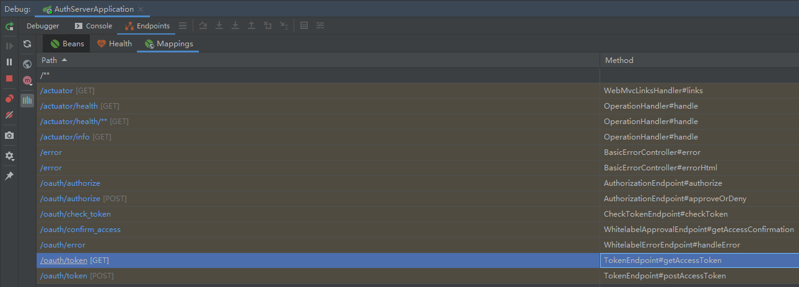

# OAuth 2.0

- http://www.ruanyifeng.com/blog/2014/05/oauth_2_0.html
  - 理解OAuth 2.0
- http://www.ruanyifeng.com/blog/2019/04/oauth_design.html
  - 用类比的方式介绍了OAuth 2.0
- http://www.ruanyifeng.com/blog/2019/04/oauth-grant-types.html
  - OAuth 2.0 的四种方式
- https://www.w3cschool.cn/oauth2/ukx21ja1.html
  - OAuth 2.0 的中文简介


# 参考实现

- http://blog.didispace.com/spring-security-oauth2-xjf-1/
  - 也能启动起来，但是登录却一直是 401
- https://www.cnblogs.com/cjsblog/p/10548022.html
  - 前后端都有的DEMO
- https://blog.csdn.net/u012702547/article/details/105699777
  - 这个最全 并且github上有多种实现方式(最终参考这个Demo实现)
    - https://github.com/lenve/oauth2-samples


# 为什么要OAuth 2.0?

# 什么是OAuth 2.0

​		OAuth引入了一个授权层，用来分离两种不同的角色：客户端和资源所有者。

​		资源所有者同意以后，资源服务器可以向客户端办法**令牌**。**客户端**通过**令牌**，去请求数据。

> 这段话的意思就是，**OAuth的核心就是向第三方应用颁发令牌**。

​		由于互联网有多种场景，RFC 6749定义了获得令牌的四种授权方式(authorization grant)。

​		也就是说，**OAuth2.0规定了四种获得令牌的流程。你可以选择最合适自己的那一种，向第三方应用颁发令牌**。下面就是这四种授权方式。

> - 授权码(authorization code)
> - 隐藏式(implicit)
> - 密码式(password)
> - 客户端凭证(client credentials)
>
> 注意，不管哪一种授权方式，第三方应用申请令牌之前，都必须先到系统备案，说明自己的身份，然后会拿到两个身份识别码：客户端ID(client ID)和客户端密钥(client secret)。这是为了防止令牌被滥用，没有备案过第三方应用，是不会拿到令牌的。

## OAuth 2.0 四种模式


### 授权码(authorization code)

​		授权码(authorization code)方式，指的是第三方应用先申请一个授权码，然后再用改码获取令牌。


### 简化(implicit)

### 密码(password)

### 客户端(client credentials)


# 实例

## 授权码(authorization code)

实例: https://github.com/malin1994515/my-learn-document/tree/master/security/authorization_code


应用相关信息

| 名称        | 类型       | 端口 |
| ----------- | ---------- | ---- |
| auth-server | 授权服务器 | 8080 |
| user-server | 资源服务器 | 8081 |
| client-app  | 第三方应用 | 8082 |


| 属性         | 说明                                                         | 提供方     |
| ------------ | ------------------------------------------------------------ | ---------- |
| code(授权码) | 使用client_id、response_type、redirect_uri、scope<br/>请求`/oauth/authorize` 获得 | 授权服务器 |
| token(令牌)  | 使用code、client_id、client_secret、redirect_uri、grant_type<br/>请求`oauth/token` 获得 | 授权服务器 |


auth-server 关于 oauth 堆外暴露的端点



| 端点                  | 含义                                                         |
| :-------------------- | :----------------------------------------------------------- |
| /oauth/authorize      | 这个是授权的端点                                             |
| /oauth/token          | 这个是用来获取令牌的端点                                     |
| /oauth/confirm_access | 用户确认授权提交的端点（就是 auth-server 询问用户是否授权那个页面的提交地址） |
| /oauth/error          | 授权出错的端点                                               |
| /oauth/check_token    | 校验 access_token 的端点                                     |
| /oauth/token_key      | 提供公钥的端点                                               |


### auth-server

认证服务器


`SecurityConfig`

> Spring Security的基本配置，用于提供用户相关信息。
>
> 目前用户信息存储在内存中。(实际项目当然是存储在数据库，因为这个项目重点不在Security所以存储在内存中)

```java
@Configuration
public class SecurityConfig extends WebSecurityConfiurerAdapter {
    // 用于密码加密
	@Bean
    PassworEncoder passwordEncoder() {
        return new BCryptPasswordEncoder();
    }
    
    // 内存中添加测试用户
    // admin/123 admin
    // user/123 user
    @Override
    protected void configure(AuthenticationManagerBuilder auth)  throw Exception {
        BCryptPasswordEncoder pwdEncoder = new BCryptPasswordEncoder();
        
        auth.inMemoryAuthenttication()
            .withUser("admin").password(pwdEncoder.encode("123")).roles("admin")
            .and()
            .withUser("user").password(pwdEncoder.encode("123")).roles("user");   
    }
    
    // 禁用跨域
    // 表单登录
    @Override
    protected void connfigure(HttpSecurity http) throws Exception {
        http.csrf().disable().formLogin();
    }
}
```


`AccessTokenConfig`

> 用于存储 token 信息

```java
/**
* 访问Token配置
* @auth 马林
*/
@Configuration
public class AccessTokenConfig {
    
    // token信息存储在内存中
    // 指定token在哪存储，我们可以存在内存中，Reids中，也可以结合JWT等等。
    @Bean
    TokenStore tokenStore() {
        return InMemoryTokenStore();
    }
}
```


`AuthorizationServer`

> 认证服务配置

```java
// 标志启动认证服务(Spring Boot 自动装配后可以省略，个人倾向保留能启动准确说明的作用)
@EnableAuthorizationServer
@Configuration
// 继承 AuthorizationServerConfigurerAdapter 这个适配器能够重写一些信息
public class AuthorizationServer extends AuthorizationServerConfigurerAdapter {
    
    
    // 在 AccessTokenConfig 中定义的 TokenStore
    @Resource
    TokenStore tokenStore;
    
    @Resource
    ClientDetailsService clientDetailService;
   
    // 在 SecurityConfig 中定义的 PasswordEncoder
    @Resource
    PassworEncoder pwdEncoder;
    
    // AuthorizationServerTokenServices 配置Token的一些基本信息
    // Token是否支持刷新、Token的存储位置、Token的有效期等等
    @Bean
    AuthorizationServerTokenServices tokenServices() {
        DefaultTokenServices services = new DefaultTokenServices();
        services.setClientDetailsService(clientDetailService);
        // 支持刷新token
        services.setSupportRefreshToken(true);
        // 在 AccessTokenConfig 中定义的 TokenStore
        services.setTokenStore(tokenStore);
        // Access Token 的有效期
        services.setAccessTokenValiditySeconds(60 * 60 * 2);
        // Refresh Token 的有效期
        services.setRefreshTokenValiditySeconds(60 * 60 * 24 * 3);
        return services;
    }
    
    // 认证code server
    // code 存储在内存中
    @Bean
    AuthorizationCodeServices authorizationCodeServices() {
        return new InMemoryAuthorizationCodeServices();
    }
    
    // AuthorizationServerSecurityConnfigurer 用来配置令牌端点的安全约束
    // 也就是这个端点谁能访问，谁不能访问。
    // checkTokenAccess是指一个Token校验的端点，这个端点我们设置为可以直接访问
    // （在后面，当资源服务器收到Token之后，需要去校验Token的合法性，就会访问这个端点）
    @Override
    public void configure(AuthorizationServerSecurityConnfigurer security) throws Exception {
        security.checkTokenAccess("permitAll()")
            .allowFormAuthenticationForClients();
    }
    
    // ClientDetailsServiceConfigurer 用来配置客户端的详细信息
    // Spring Security 用于校验用户，ClientDetailsServiceConfigurer 用于校验客户端
    @Override
    public void configure(ClientDetailsServiceConfigurer clients) throws Exception {
        clients.inMemory()
            .withClient("custom_client_1").secret(pwdEncoder.encode("123"))
            .resourceIds("user_resource")
            .authorizedGrantTypes("authorization_code", "refresh_token")
            .scopes("all")
            .redirectUris("http://localhost:8082/index.html");
    }
    
    // AuthorizationServerEndpointsConfigurer 配置令牌的访问端点和令牌服务
    // authorizationCodeServices 用来配置授权码和存储
    // tokenServices 用来配置令牌的存储，即access_token的存储位置
    // 授权码和令牌有什么区别？授权码是用来获取令牌的，使用一次就失效，令牌是用来获取资源的。
    @Override
    public void configure(AuthorizationServerEndpointsConfigurer endpoints) throws Exception {
        // code server
        endpoints.authorizationCodeServices(authorizationCodeServices())
            // token server
            .tokenServices(tokenServices());
    }
}
```


### user-server

​		接下来我们搭建一个资源服务器。大家网上看到的例子，资源服务器大多都是和授权服务器放在一起的，如果项目比较小，这样做是没有问题的，但是如果是一个大项目，这种做法就不合适了。

​		资源服务器就是用来存放用户的资源，例如你在微信上的图像、openid等信息，用户从授权服务器上拿到access_token之后，接下来就可以通过access_token来资源服务器请求资源。


`ResourceServerConfig`

> 配置资源服务器

```java
@EnableResourceServer
@Configuration
public class ResourceServerConfig extends ResourceServerConfigurerAdapter {
    
    // tokenServices我们配置了一个RemoteTokenServices的示例。
    // 这是因为资源服务器和授权服务器是分开的。
    // RemoteTokenServices中配置access_token的校验地址、clientId、clientSecret。
    // 当用户来资源服务器请求资源时，会携带上一个access token，通过这里的配置，就能校验出token是否正确。
    @Bean
    RemoteTokenServices tokenServices() {
        RemoteTokenServices services = new RemoteTokenServices();
        services.setCheckTokenEndpointUrl("http://localhost:8080/oauth/check_token");
        services.setClientId("custom_client_1");
        services.setClientSecret("123");
        return services;
    }
    
    // 声明 resource id
    @Override
    public void configure(ResourceServerSecurityConfigurer resources) {
        resources.resourceId("user_resource").tokenServices(tokenServices());
    }
    
    // Spring Security 的拦截规则
    @Override
    public void configure(HttpSecurity http) throws Exception {
        http.authorizeRequests()
            .antMatchers("/admin/**").hashRole("admin")
            .anyRequest().authenticated();
    }
}
```


编写两个测试接口

`HelloController`

```java
@RestController
public class HelloController {
    @GetMapping("/hello")
    public String hello() {
        return "hello";
    }
    
    @GetMapping("/admin/hello")
    public String admin() {
        return "admin";
    }
}
```


### client-app

接下来搭建第三方应用程序。

> 注意，第三方应用并非必须，下面缩写的代码也可以用postman去测试。


在`resources/templates`目录下，创建`index.html`

```html
<!DOCTYPE html>
<html lang="en" xmlns:th="http://www.thymeleaf.org">
<head>
    <meta charset="UTF-8">
    <title>客户端应用</title>
</head>
<body>
客户端应用

<a href="http://localhost:8080/oauth/authorize?client_id=javaboy&response_type=code&scope=all&redirect_uri=http://localhost:8082/index.html">第三方登录</a>

<h1 th:text="${msg}"></h1>
</body>
</html>
```

这一段Thymeleaf模板，点击超链就可以实现第三方登录

- client_id：根据我们在授权服务器中的实际配置填写
- response_type：表示响应类型，这里code表示响应一个授权码
- redirect_uri：表示授权成功后的重定向地址，这里表示回到第三方应用的首页
- scope：表示授权范围

H1标签中的数据是来自资源服务器的，当授权通过后，我们拿着access_token去资源服务器加载数据，加载到的数据就在H1标签中显示出来。


`HelloController`

```java
@RestController
public class HelloController {
    @Resource
    RestTemplate restTemplate;
    
    @GetMapping("/index.html")
    public String hello(String code, Model model) {
        if (code != null) {
            // 使用授权码(一次性的)获取token
            MultiValueMap<String, String> param = new LinkedMultiValueMap<>();
            param.add("code", code);
            param.add("client_id", "custom_client_1");
            param.add("client_secret", "123");
            param.add("redirect_uri", "http://localhost:8082/index.html");
            param.add("grant_type", "authorization_code");
            Map<String, String> resp = restTemplate.postForObject("http://localhost:8080/oauth/token", map, Map.class);
            
            // 携带 access token 请求资源服务器
            String accessToken = resp.get("access_token");
            System.out.println(accessToken);
            HttpHeaders headers = new HttpHeaders();
            headers.add("Authorization", "Bearer " + accessToken);
            HttpEntity<Object> httpEntity = new HttpEntity<>(headers);
            restTemplate.exchange("http://localhost:8081/admin/hello", HttpMethod.GET, httpEntity, String.class);
            
            // 将结果写入Model
            model.addAttribute("msg", entity.getBody());
        }
        return index;
    }
}
```


## 简化(implicit)


## 密码(password)


## 客户端(client credentials)


## 整合 redis + postgresql 存储应用和token信息


## 整合 jwt 实现无状态


## 配合实现SSO


## 使用github 登录