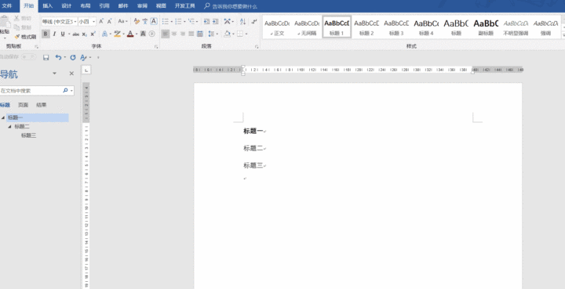
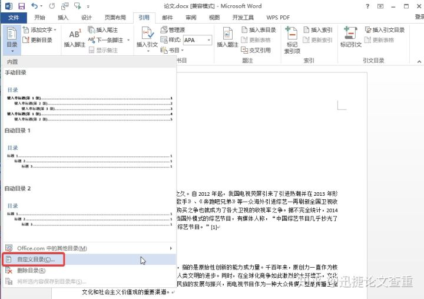
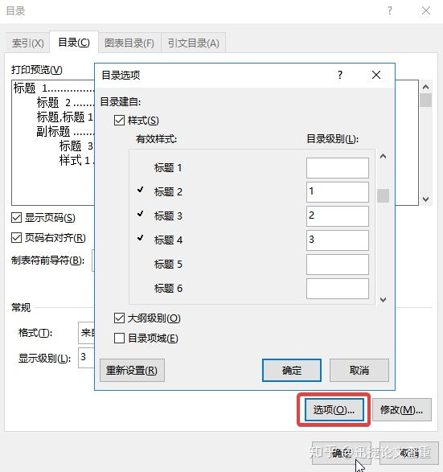

# 数据字典半自动生成

利用 `information_schema` 为主通过查询生成数据字典。

- http://www.manongjc.com/detail/17-gwtxynfxauxzcaz.html

```sql
SELECT
	col.table_schema,
	col.table_name,
	col.ordinal_position,
	col.column_name,
	col.data_type,
	col.character_maximum_length,
	col.numeric_precision,
	col.numeric_scale,
	col.is_nullable,
	col.column_default,
	des.description 
FROM
	information_schema.COLUMNS col
	LEFT JOIN pg_description des ON col.table_name :: regclass = des.objoid 
	AND col.ordinal_position = des.objsubid 
WHERE
	table_schema = 'public' 
	AND table_name = 'rc_app_authority'
ORDER BY
	ordinal_position;
```


```sql
SELECT
	col.COLUMN_NAME AS "属性",
	col.udt_name AS "数据类型",
	col.is_nullable AS "允许为空",
	des.description AS "说明" 
FROM
	information_schema.COLUMNS col
	LEFT JOIN pg_description des ON col.TABLE_NAME :: regclass = des.objoid 
	AND col.ordinal_position = des.objsubid 
WHERE
	table_schema = 'public' 
	AND TABLE_NAME = 'rc_app_authority' 
ORDER BY
	ordinal_position;
```


# Markdown 转 World

https://www.zhihu.com/question/22972843

```shell
pandoc -f markdown -t html ./test.md
pandoc -f html -t docx -o output.docx
# 直接转换
pandoc -f markdown -t docx ./test.md -o test.docx
# GitHub风格
pandoc -f gfm -t docx ./test.md -o test.docx
```


# Word 调整整篇文档的字体

https://zhidao.baidu.com/question/238864824.html


# Word 标题自动生成序号

https://jingyan.baidu.com/article/bad08e1e84aa8109c85121af.html


https://zhuanlan.zhihu.com/p/37470651



# Word 自动生成目录

https://www.zhihu.com/question/20540465/answer/884991521




